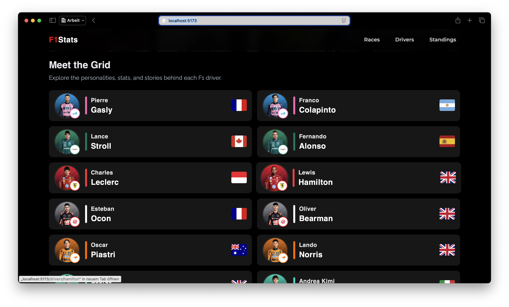
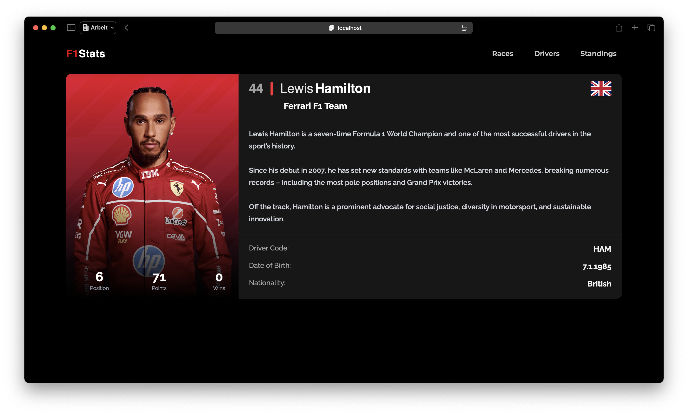
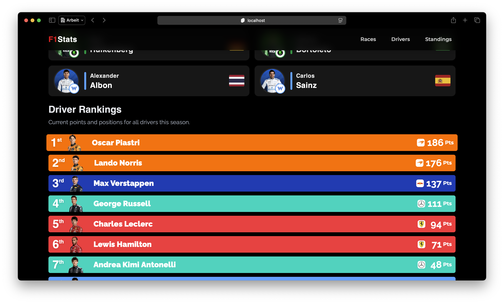
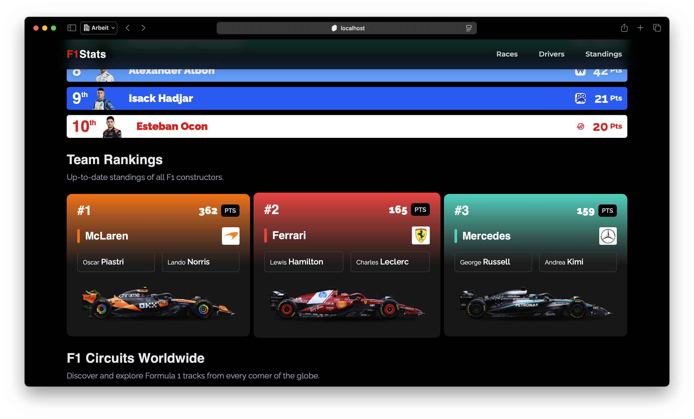
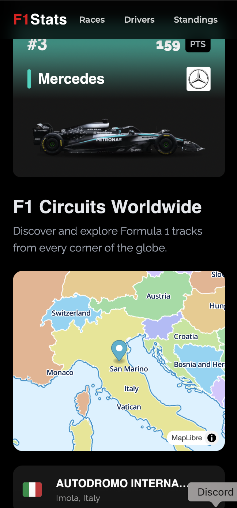

# 🏁 F1 Stats

A sleek and fast Formula 1 statistics web app built with **SvelteKit**, **TypeScript**, and **TailwindCSS**, powered by the [Ergast F1 API](https://ergast.com/mrd/). It provides driver profiles, constructor standings, race details, and historical stats in a modern UI.

---

## 🚀 Features

- 🧑‍💼 Detailed driver profiles (bio, stats, nationality, birth date)
- 🏎️ Constructor overviews with drivers and car details
- 📊 Standings for drivers and teams
- 🔍 Clean, responsive UI with TailwindCSS and animated transitions

---

## 🛠️ Tech Stack

- **[SvelteKit](https://kit.svelte.dev/)** – Modern web framework
- **TypeScript** – Type safety for better dev experience
- **TailwindCSS** – Utility-first CSS framework
- **[Ergast F1 API](https://ergast.com/mrd/)** – Free F1 data source

---

## 📸 Screenshots

### 🖥 Desktop-Ansichten

  
  
  
  
  

  
  

---

## 📍 Roadmap

- [x] Base layout with routing and page transitions
- [x] Drivers, races, and constructors pages
- [ ] Add charts and visual stats (e.g., wins per year)
- [ ] Search functionality for drivers and teams
- [ ] All tracks with map location

---

## 🤝 Contributing

Pull requests are welcome. For major changes, please open an issue first to discuss what you would like to change.
